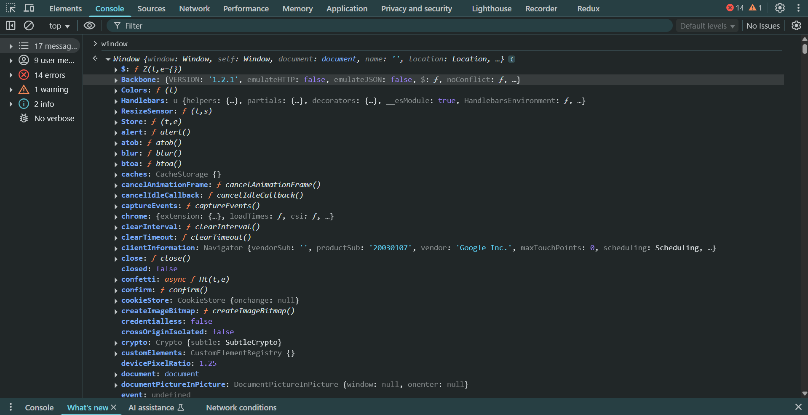
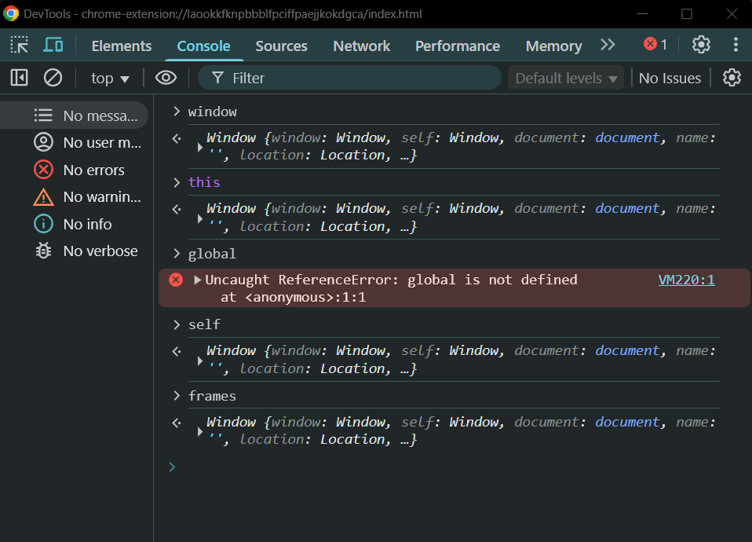
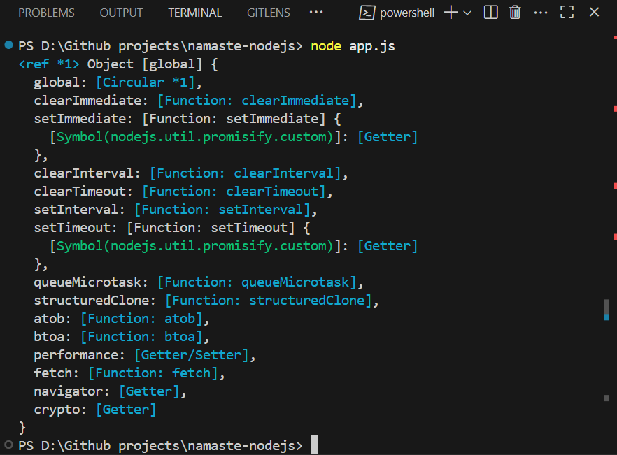

# S01 E03 – Let's Write Code

### Installing and Checking Versions

- **nvm** stands for Node Version Manager.
- To check your Node version, run: `node -v` → e.g., `v16.17.0`
- When you install Node.js, **npm** (Node Package Manager) is installed automatically.
- To check your npm version: `npm -v` → e.g., `8.15.0`

---

### Node.js REPL

- **REPL** stands for **Read–Evaluate–Print–Loop**. It is the quickest way to run JavaScript code in Node.js.
- To enter REPL mode, open your terminal and type: `node`

```js
> 1 + 1;
2
> var a = "Simran Gangwani";
undefined
> a;
'Simran Gangwani'
> var i = 10;
undefined
> var j = 20;
undefined
> i + j;
30
```

- This is how we can run JavaScript directly inside Node.js.
- REPL acts as an interactive playground running on Node’s runtime environment.
- Node.js uses the **V8 JavaScript Engine** internally to execute the code, just like browsers do.
- So when we type JS code in the terminal, Node forwards it to the V8 engine for execution.
- REPL in Node is similar to the browser console, as both use V8 behind the scenes.

---

### Executing JS Files in Node

```js
// app.js
var name = "Simran Gangwani";
var a = 10;
var b = 20;

console.log(name); // Simran Gangwani
console.log(a + b); // 30
```

- Save the above code in a file, say `app.js`.
- To execute it using Node:
  Run `node app.js` in the terminal.

---

## Global Object in JavaScript

### In the Browser

- The global object in browsers is called `window`.
- At the global level, the `this` keyword also refers to `window`.

```js
console.log(window); // global object
console.log(this); // also refers to window
```



- Additional references to the global object in browsers:

  - `self` (used in web workers)
  - `frames`

- All the above point to the same `window` object.

  

### In Node.js

- Node’s global object is called `global`.
- Example:

```js
console.log(global);
```



```js
console.log(global); // logs Node's global object
console.log(this); // logs {} (empty object)
```

- `global` is not a part of V8 eengine. It is one of the superpowers given to us by Node.js
- `global` provides access to Node-specific features like `setTimeout()`, `setInterval()`, etc.
- These are not part of the V8 engine. Instead, Node injects them into the environment using `global`.

### Key Difference

| Environment | Global Object | `this` (at global scope)      |
| ----------- | ------------- | ----------------------------- |
| Browser     | `window`      | refers to `window`            |
| Node.js     | `global`      | refers to `{}` (empty object) |

---

### Inconsistencies Across Environments

- Trying to use `global` in the browser will result in:
  `Uncaught ReferenceError: global is not defined`
- Due to different keywords for the global object (`window`, `global`, `self`, etc.), there were inconsistencies across environments.
- In 2020, to standardize this, the **JavaScript committee (TC39)** introduced a new universal keyword: **`globalThis`**.
- The committee didn't decided on any exsisting keyword as it might create some issues with some of the projects using it as a variable name.

### `globalThis`

- `globalThis` refers to the global object across **all JavaScript environments** — browsers, Node.js, etc.
- It solves the inconsistency caused by environment-specific global objects.

```js
globalThis === global; // true in Node.js
globalThis === window; // true in browser
```
