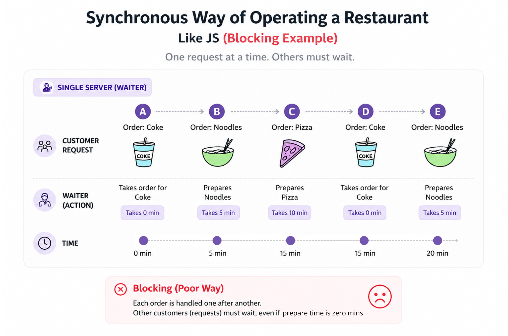
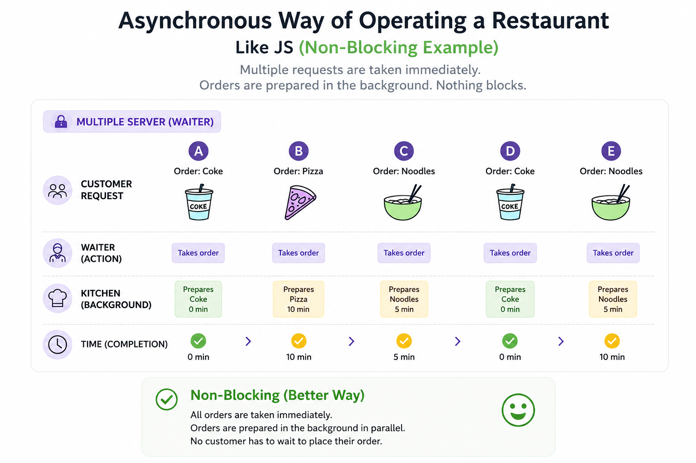
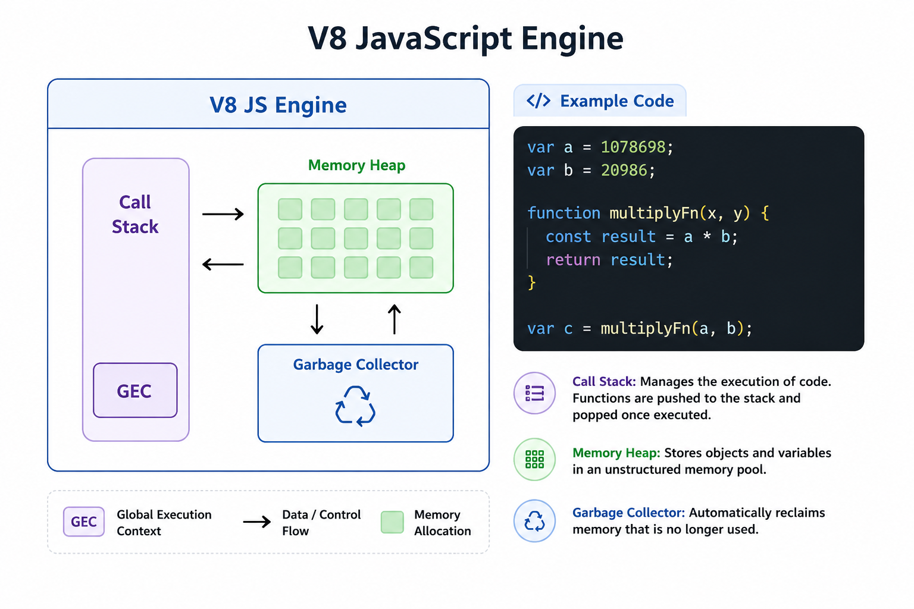
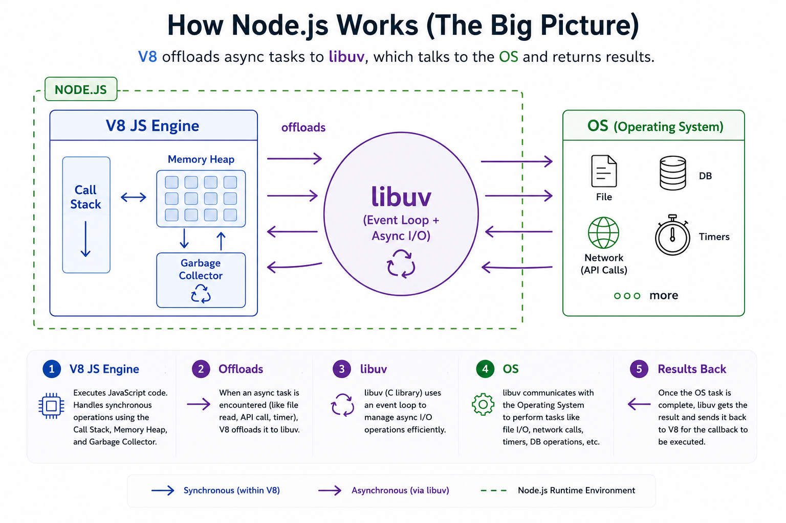
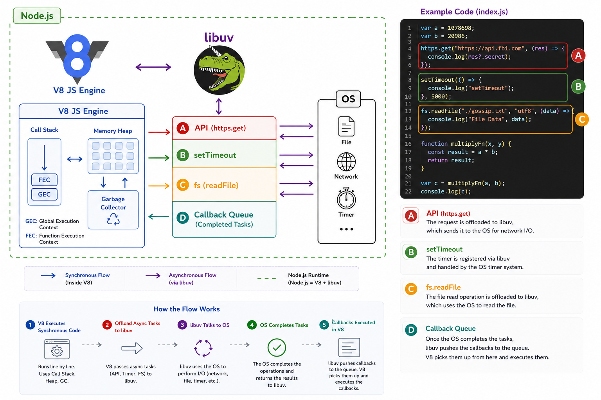

# S01 E06 – libuv and Asynchronous I/O

## JavaScript and Threads

- Node.js has an **event-driven architecture** capable of **asynchronous I/O**.
- JavaScript is a **synchronous, single-threaded** language. It runs on a single thread (the V8 engine).
- In operating systems, there are many processes. A **thread** is like a container where a process runs.
- **Multithreading**: multiple threads share the same memory. Parts of code can execute in different threads simultaneously.
- A single-threaded language has limitations. For example, if it receives multiple requests or does heavy computation, the thread may be blocked.
- JavaScript is good at executing synchronous, fast code, but it struggles with tasks that require waiting.

---

## Sync vs Async Examples

- **Synchronous operation** (like blocking a restaurant workflow):
  

- **Asynchronous operation** (non-blocking, efficient restaurant workflow):
  

- JavaScript itself is synchronous.

- With the **superpowers of Node.js**, it can perform asynchronous tasks.

---

## Sync vs Async Tasks

- **Synchronous tasks**: executed immediately.
- **Asynchronous tasks**: take time to complete (e.g., API calls, file I/O).

Example:

- A heavy `multiplyFn` runs quickly because it is synchronous.

```js
var a = 1078698;
var b = 20986;

function multiplyFn(x, y) {
  const result = a * b;
  return result;
}

var c = multiplyFn(a, b);
```

- An API call, however, blocks the engine for seconds if not handled asynchronously.

```js
https.get("https://api.fbi.com", (res) => {
  console.log("secret data:", res.secret);
});

fs.readFile("./gossip.txt", "utf8", (data) => {
  console.log("File Data", data);
});

setTimeout(() => {
  console.log("Wait here for 5 seconds");
}, 5000);
```

- JavaScript wants to keep its call stack clear, so such tasks are delegated.

---

## The JS Engine

- The JS engine has a **single call stack** where all code executes.
- **Memory Heap**: stores variables and functions during execution.
- **Garbage Collector**:
  - Cleans up unused variables/functions (e.g., after a variable is no longer needed).
  - In C/C++, developers manage memory manually.
  - In JavaScript, V8 automatically handles memory management and garbage collection.

  

V8 engine responsibilities:

- Manage garbage collection
- Manage memory
- Manage the call stack
- Execute all code

---

## Why Node.js Needs libuv

- The JS engine can only handle synchronous code. It **cannot**:
  - Read/write files
  - Access a database
  - Make API calls
  - Handle timers

- Node.js bridges this gap using **libuv**, a C library.

- libuv gives JavaScript the ability to perform async tasks by interacting with the OS.

- V8 offloads asynchronous tasks to libuv.

- libuv then communicates with the OS and returns results back to V8.



---

## What is libuv?

- A **multi-platform C library** (97% C code) that supports **asynchronous I/O** using an event loop.
- Acts as a **middle layer** between the JS engine and the OS.
- JavaScript (high-level) cannot directly interact with the OS, so libuv (written in C) provides this bridge.
- Features of libuv:
  - Event loop
  - Thread pool
  - Async I/O utilities

- Node.js repo path: `deps/uv`
- libuv is also used in other programming languages, not just Node.js.

---

## Code Walkthrough – How libuv Works



- Callbacks `A`, `B`, and `C` represent async tasks (API call, setTimeout, file read, etc.).

- Example with `multiplyFn`:
  - When `multiplyFn` runs, a **Function Execution Context (FEC)** is pushed onto the call stack.
  - Variable `result` is created in the memory heap.
  - After execution, FEC is popped from the call stack.
  - The garbage collector clears memory used by `result`.

- When async tasks finish:
  - File system (FS) callback `C` → pushed to call stack → executed → popped.
  - API callback `A` → pushed → executed → popped.
  - Timer callback `B` → pushed → executed → popped.


---

## Key Takeaways

- Node.js is **asynchronous and non-blocking**.
- V8 is **synchronous**, but Node.js extends it with **libuv**.
- libuv provides async I/O capabilities, event loop, and threadpool.
- Even with a single thread, Node.js efficiently handles async tasks.
- Ryan Dahl combined V8 + libuv to create Node.js.

---
