# S01 E08 – Deep Dive into the V8 JS Engine

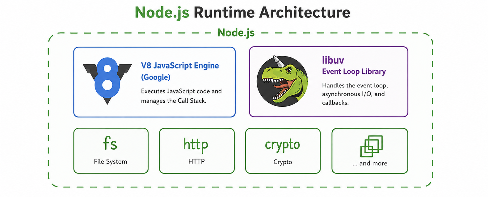

The JS code you write is passed to the V8 engine, which processes it through several steps:

---

## Step 1: Parsing

### 1. Lexical Analysis

- The code is broken down into **tokens**.
- The V8 engine reads code **token by token** (not line by line). This process is also known as **tokenization**.

### 2. Syntax Analysis

- An **AST (Abstract Syntax Tree)** is generated from the tokens.
- This step is also known as **syntax parsing**.
- Visit [astexplorer.net](https://astexplorer.net) to explore ASTs interactively.

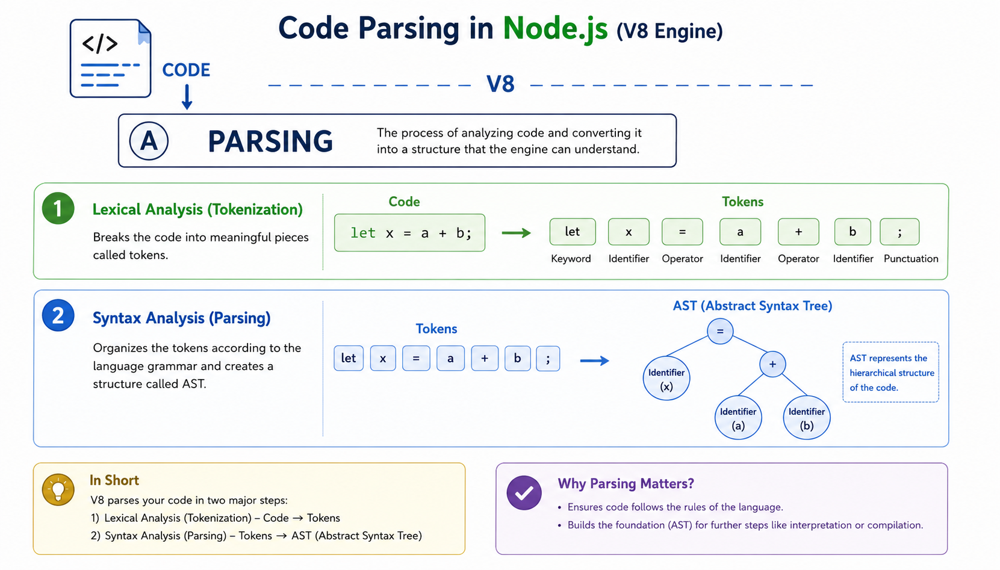

- Whenever we declare a variable, it has two parts:
  - **Identifier** – the name of the variable (e.g., `x`)
  - **Literal** – the value assigned (e.g., `"Namaste Node JS"`)

```js
var x = "Namaste Node JS";
```

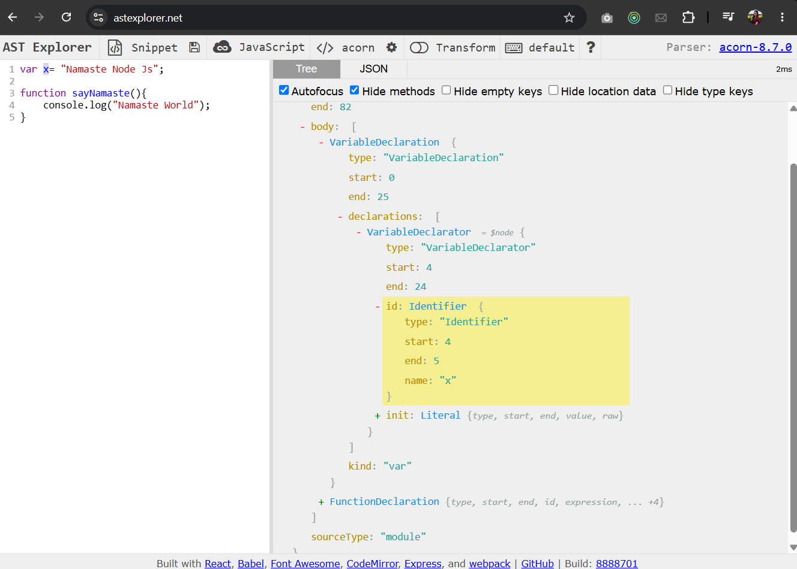
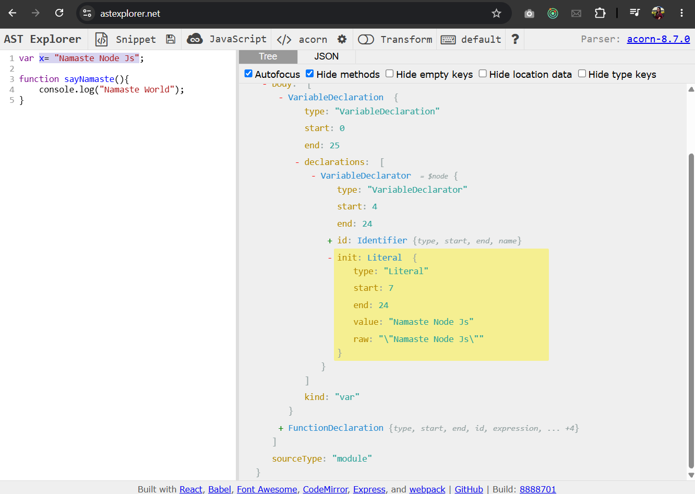

- `var x = "Namaste Node JS";` is broken down into an object (as shown in the images above), which contains a declaration with an `identifier` and a `literal`.

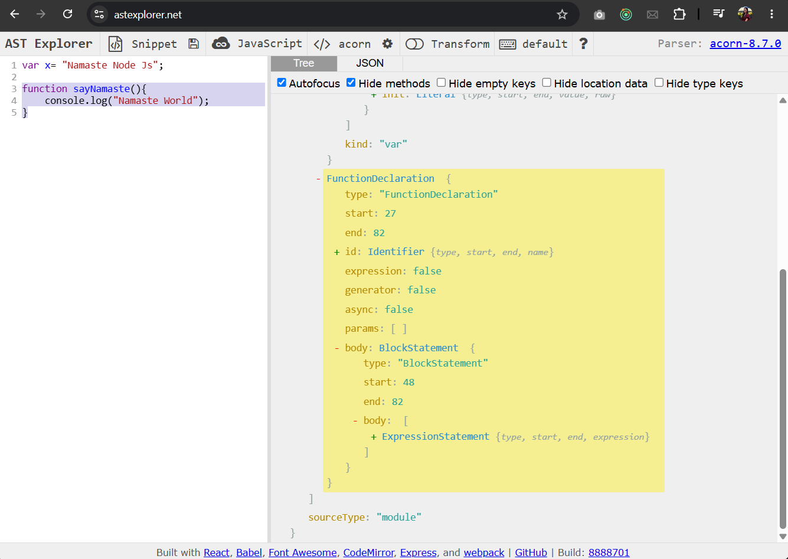

#### Syntax Error

- When the AST cannot be generated from your code, the engine throws a **Syntax Error**.

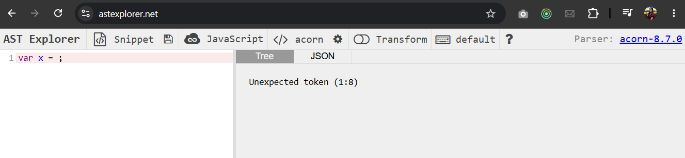

- JSON view:

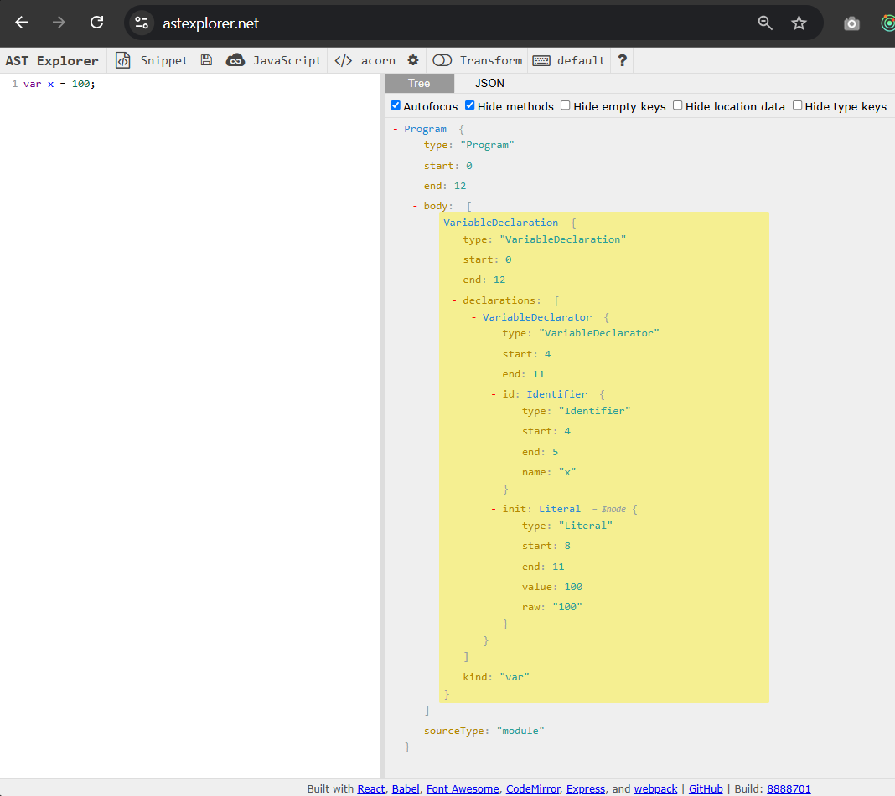

---

## Step 2: Interpreter

### Interpreted Languages

- The interpreter reads and executes code **line by line**.
- It interprets a line, executes it, then moves to the next.
- Characteristics:
  - Reads code line by line
  - Fast initial execution
  - Uses an interpreter

### Compiled Languages

- The entire source code is compiled first - high-level code is translated into machine code, which is then executed.
- Initial compilation is time-intensive, but subsequent execution is fast.
- Example: In Java, the entire source code must be built into a bundle; the resulting machine code is then executed.
- Uses a compiler

### JIT Compilation

> **Note:** JavaScript is both compiled and interpreted.

- JS is neither purely compiled nor purely interpreted, it uses **both** a compiler and an interpreter.
- The V8 engine contains both an interpreter and a compiler.
- The compilation method used in JavaScript is known as **JIT (Just-In-Time) Compilation**.

---

- Purely interpreted languages are generally considered slow. Compiled languages have a heavier initial compilation phase but execute faster afterward.

---

- **Ignition** – Google V8 engine's interpreter
- **TurboFan** – Google V8 engine's compiler

---

### Understanding the Flow of Step 2

- The AST from Step 1 is passed to the **Ignition interpreter**.
- Ignition's job is to convert the code into **byte code**.
- After conversion to byte code, execution begins.

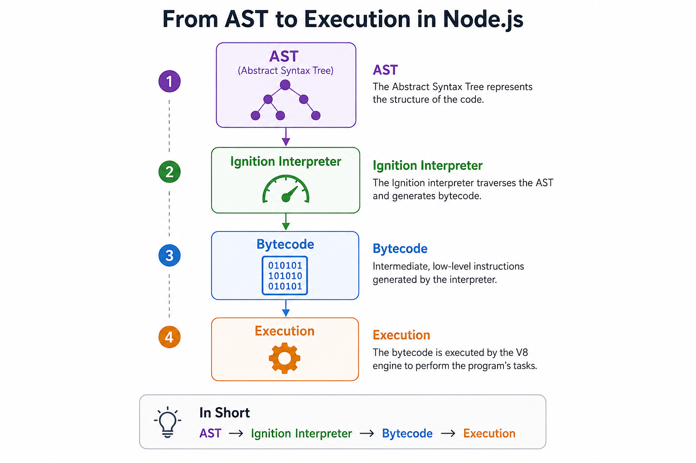

**But since JS is a JIT compiled language, where does the compiler come in?**

- When the AST is given to Ignition, it identifies frequently executed portions of code (called **HOT CODE**) and passes them to the **TurboFan compiler** for optimization and compilation - so that the next execution is significantly faster.
- The major drawback of a pure interpreter is that it cannot execute code quickly enough for hot paths. TurboFan addresses this by offloading hot code segments for compilation and optimization.
- This process is called **optimization**. TurboFan may also perform **deoptimizations** when its assumptions turn out to be incorrect.

**Example:**

- Consider a `sum` function that adds two numbers. TurboFan assumes it will always receive numbers and optimizes accordingly.
- If strings are passed instead, the assumption fails - TurboFan **deoptimizes** the code and hands it back to Ignition, which converts it to byte code and executes it normally.

**Detailed walkthrough:**

- Suppose there is a `sum(a, b)` function. You call it with `10` and `7`, then again with `6` and `7`. Ignition recognizes this function is being called repeatedly, marks it as HOT CODE, and passes it to TurboFan for optimization.
- TurboFan assumes `a` and `b` are always numbers. Execution is very fast as long as numbers are passed.
- If you later pass strings or objects, the assumption fails, TurboFan deoptimizes the code, and Ignition takes over again - converting it back to byte code and executing it.

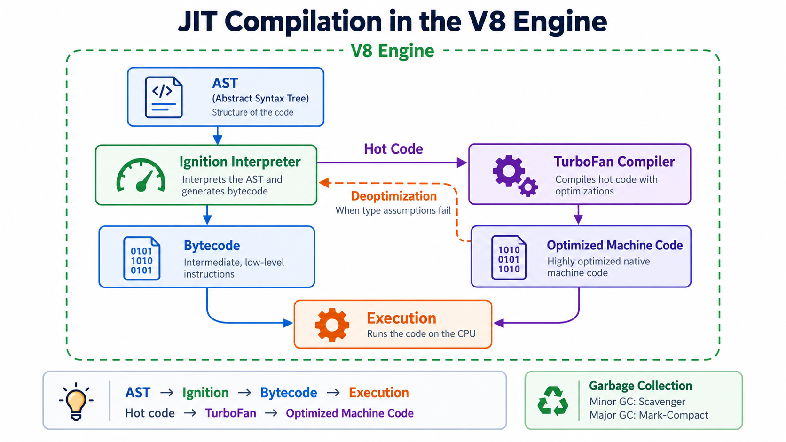

> The image above represents the JIT compilation flow.

---

- In addition to all the above steps, the V8 engine performs **garbage collection** simultaneously.

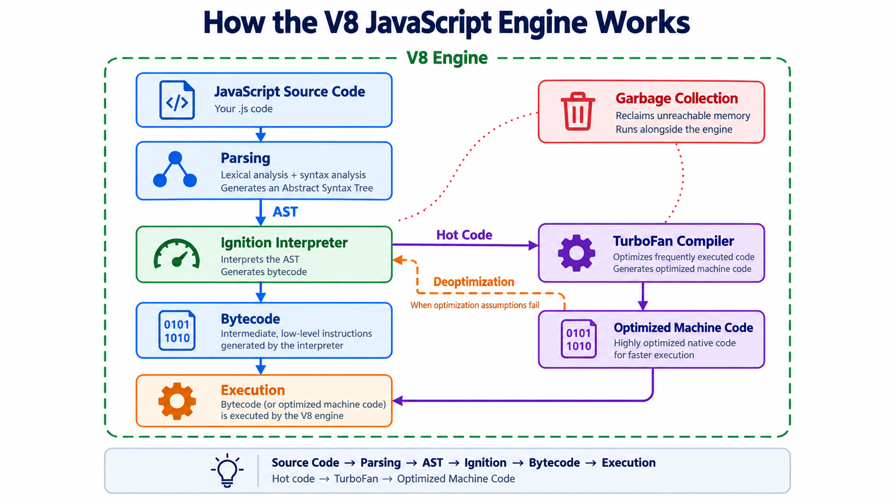

---

> **Further reading:** Inline Caching & Copy Elision

### Types of Garbage Collectors in Chrome's V8 Engine

1. **Orinoco**
2. **Oil Pan**
3. **Scavenger**
4. **Mark Compact**

- The **Mark & Sweep** algorithm runs in the background.

---

> All of the above applies to the **Chrome V8 engine architecture**. Behavior may differ across different JS engines.

- V8 GitHub repo → `src/compiler` - _(TurboFan compiler source)_
- Before TurboFan, there was the **Crankshaft** compiler, it is no longer used and was removed in later versions of V8.

### How Does Byte Code Look?

- V8 GitHub repo → `test/cctest/interpreter/bytecode_expectations/ForIn.golden` — _(byte code for the `for...in` loop)_

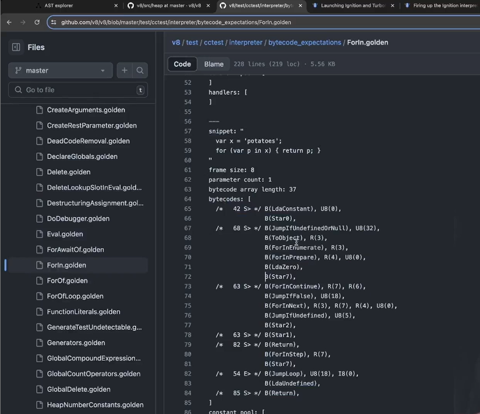

> The image above shows a normal JS `for...in` loop and its corresponding byte code.

- V8 GitHub repo → `test/cctest/interpreter/bytecode_expectations/IfConditions.golden` — _(byte code for `if` conditions)_


> The image above shows a normal JS `if` condition and its corresponding byte code.

---

> **Resources:** Visit [v8.dev/blog](https://v8.dev/blog) (read the _"Launching Ignition and TurboFan"_ blog) and [v8.dev/docs](https://v8.dev/docs) to learn more.

### Garbage Collector Types (Summary)

1. **Major Garbage Collector:** Mark Compact
2. **Minor Garbage Collector:** Scavenging
