# S01 E09 – Libuv & the Event Loop

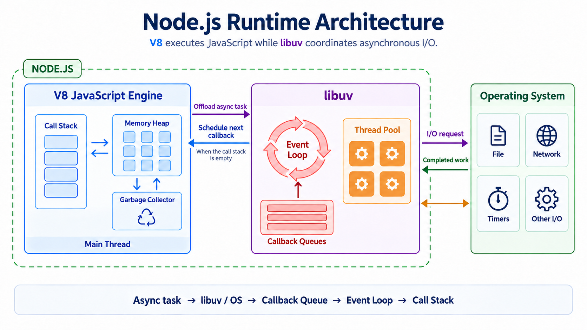

Node.js has two major components:

- **V8 JS Engine**
- **libuv**

---

## What's Inside libuv

1. Event Loop
2. Callback Queue
3. Thread Pool

- Asynchronous I/O and non-blocking I/O in Node.js are only possible because of **libuv**.

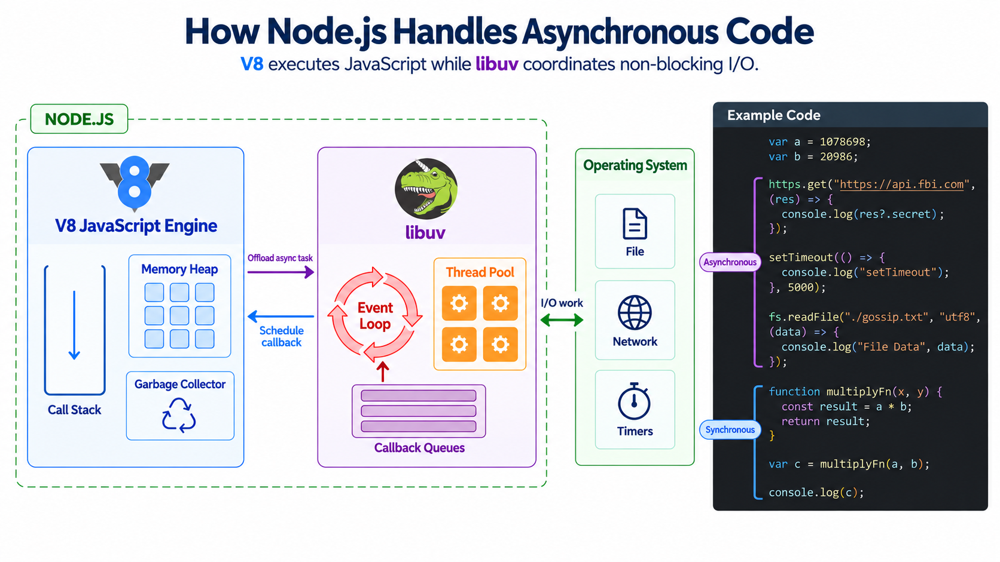

- In the code above, we have a `setTimeout`. When the timer expires, it is libuv's job to push its callback into the call stack of the JS engine for execution.
- Suppose the V8 engine is busy running some code and multiple callbacks from async tasks are waiting to be executed - libuv manages these using **callback queues**.
- If the JS engine is busy executing a task, all callbacks wait in their respective callback queues.
- The event loop keeps running. Its only job is to continuously check the **call stack** and the **callback queue**. If there are tasks waiting in the callback queue and the call stack is empty, the event loop picks the next task from the callback queue and sends it to the JS engine for execution - at the correct time and in the correct order (based on priority).

**The event loop can only send a task when:**

- The V8 engine is idle, OR
- The call stack is empty, OR
- The main thread is not blocked

---

## Event Loop Phases

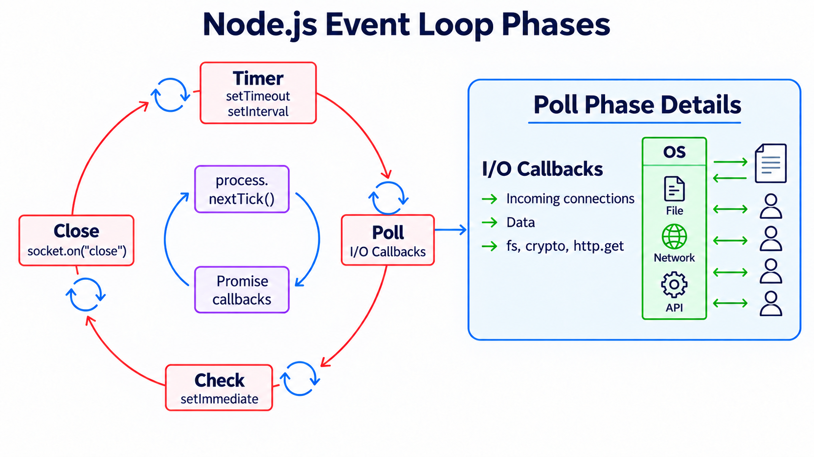

- The **blue cycle** in the center represents a **priority queue** - it is executed before each of the 4 main phases.
- The event loop has **four major phases**, executed one after the other:

1. **Timer** – All callbacks associated with timers are executed in this phase.
   - `setTimeout`
   - `setInterval`
2. **Poll** – Handles I/O callbacks.
   - Incoming connections
   - Data
   - `fs`, `crypto`, `http` (GET requests), etc.
3. **Check**
   - `setImmediate`
4. **Close** – All close operations happen here. For example, handling `.on("close")` on a socket. This is essentially a cleanup/closing phase.

- The event loop continuously cycles through these phases while also checking whether the call stack is empty. If the call stack is empty, it schedules the next callback according to the event loop cycle.

---

## `process.nextTick()` - When Does It Run?

> **Question:** When are `process.nextTick()` callbacks run?

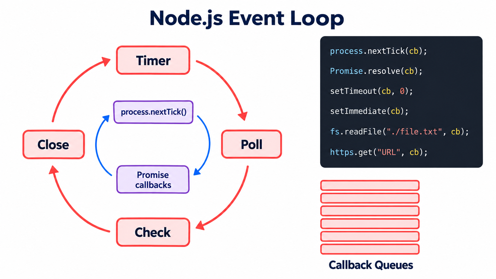

```
process.nextTick
Promise.resolve
setTimeout
fs.readFile
https.get
setImmediate
```

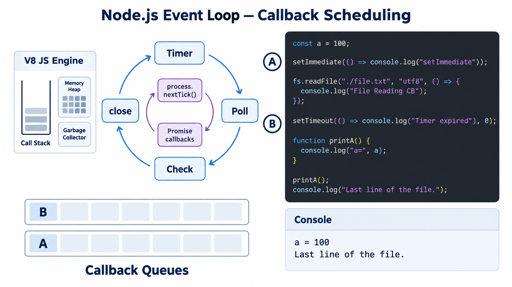

> Callbacks `A` and `B` are waiting in their respective callback queues while the file read operation is still in progress.

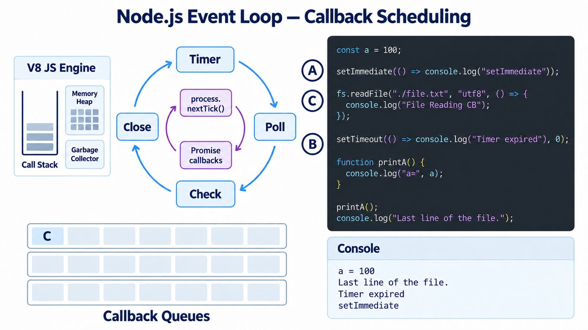


---

## Example 1

```javascript
const fs = require("fs");
const a = 100;

setImmediate(() => console.log("setImmediate"));

fs.readFile("./file.txt", "utf8", () => {
  console.log("File Reading CB");
});

setTimeout(() => console.log("Timer expired"), 0);

function printA() {
  console.log("a=", a);
}

printA();
console.log("Last line of the file.");
```

- Although the poll phase (file reading) comes before `setImmediate` in the event loop cycle, file reading is still executed after `setImmediate`. This is because file reading may take more time, so the file read callback ends up being processed in the **next cycle** of the event loop.

**Output:**

```text
a = 100
Last line of the file.
Timer expired
setImmediate
File Reading CB
```

---

## Example 2

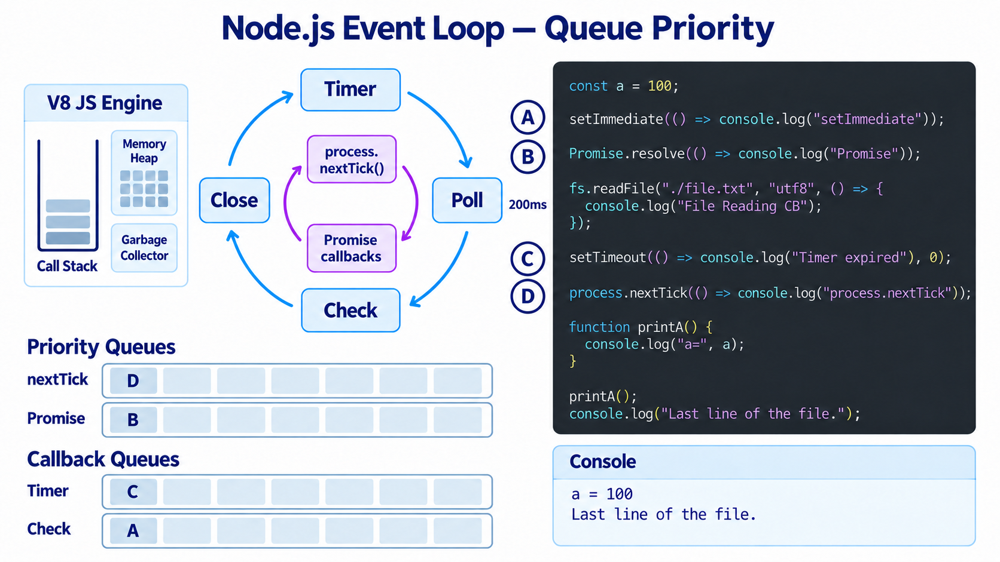
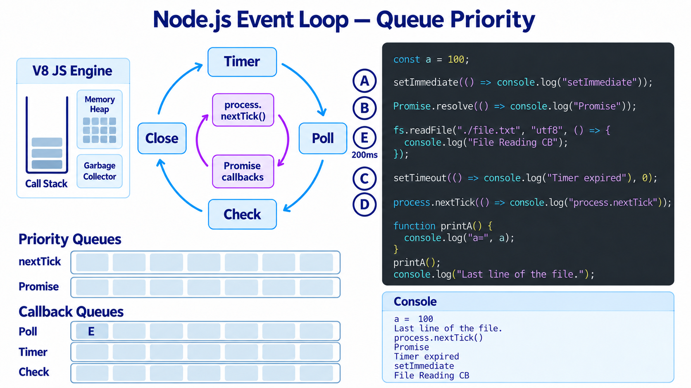
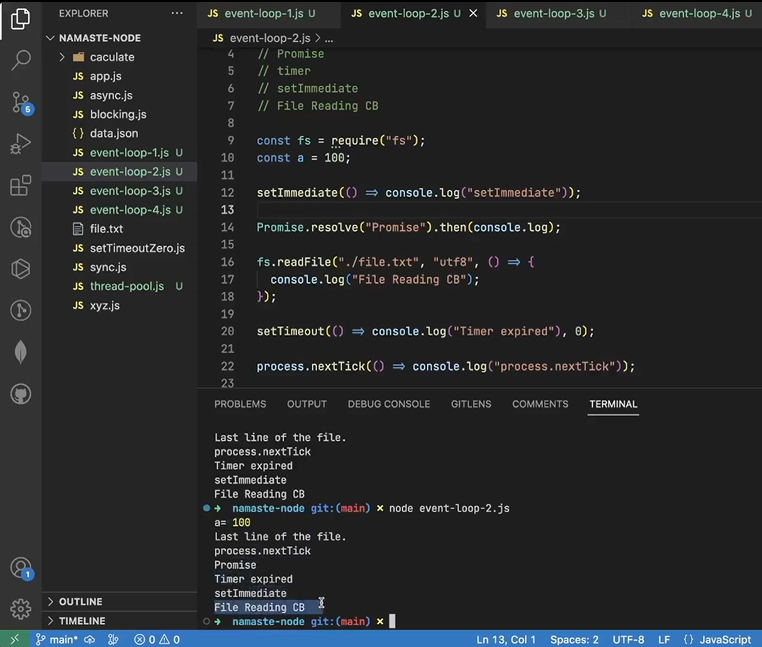

> The image above shows the corrected Promise code.

**Output:**

```text
a = 100
Last line of the file.
process.nextTick
Promise
Timer expired
setImmediate
File Reading CB
```

- Since file reading takes time, its callback is processed in the next event loop cycle. `setImmediate` (check phase) is executed after `Timer expired` (timer phase) within the same cycle.

---

## The Poll Phase - Where the Event Loop Waits

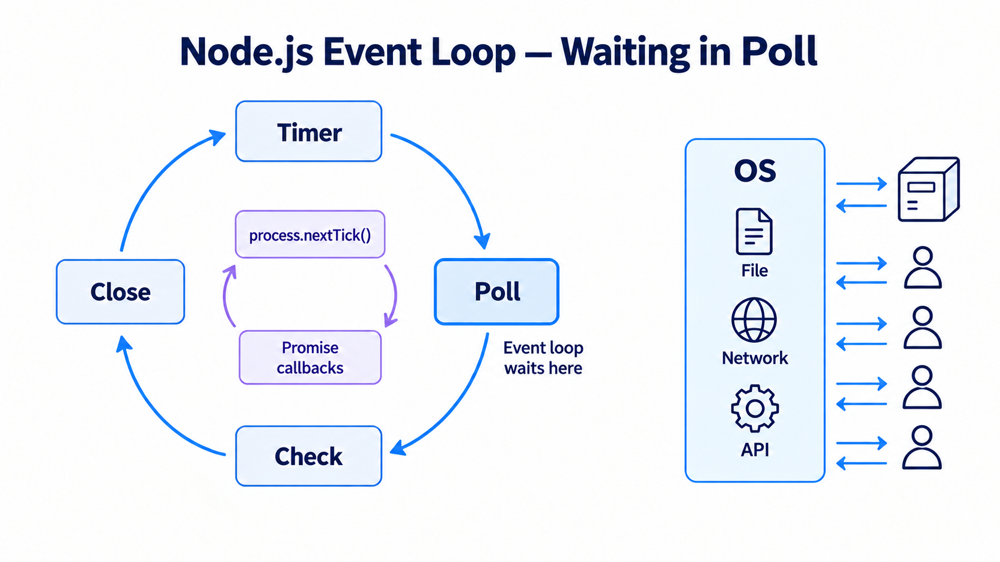

- When the event loop has nothing left to do and the call stack is also empty, it **waits at the poll phase**.
- It stays there until a poll event occurs (e.g., an incoming I/O event).
- The event loop in the **browser** and in **Node.js** behaves differently:
  - In the browser, the event loop keeps running continuously.
  - In Node.js, when there is nothing to execute, it waits at the **poll phase**.
- This is why some people call the Node.js event loop a **semi-infinite loop** — it keeps running when there is work to do, and waits at the poll phase when there is nothing.

---

## Example 3

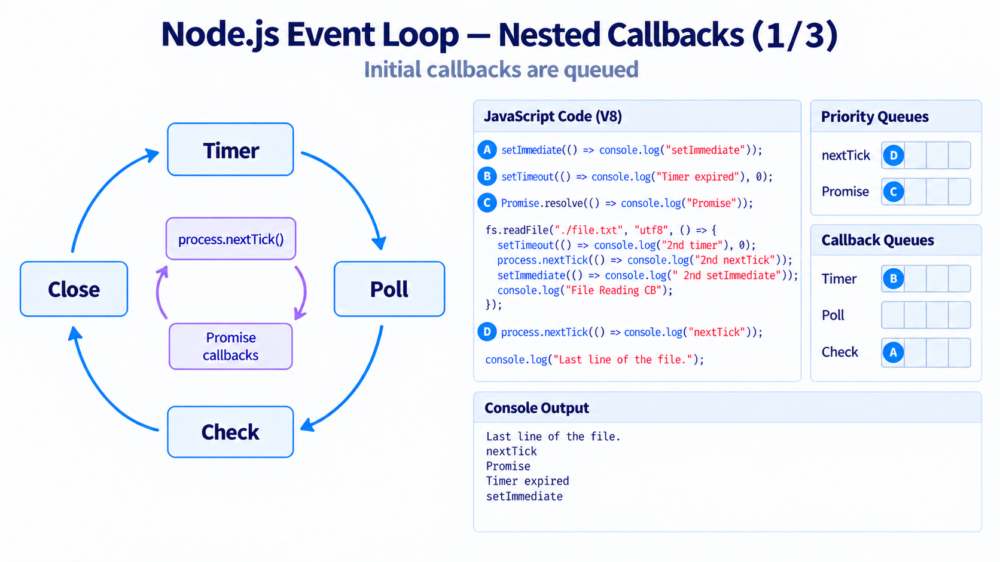
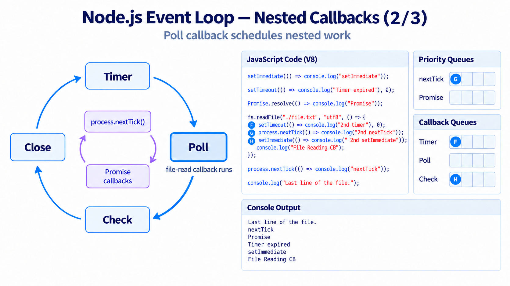
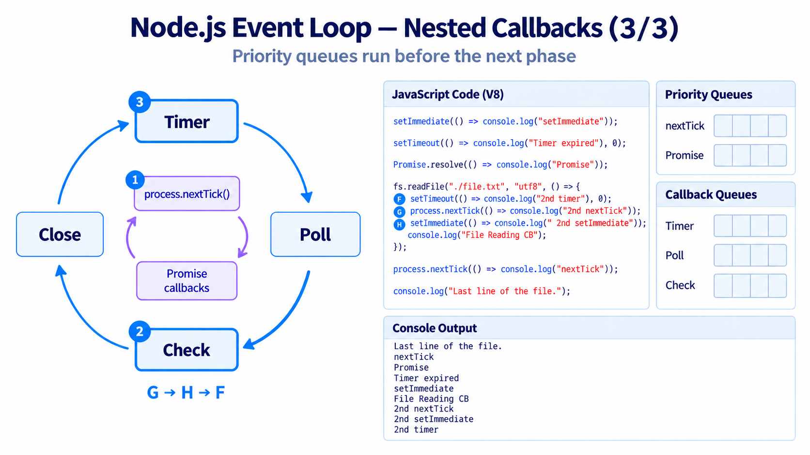
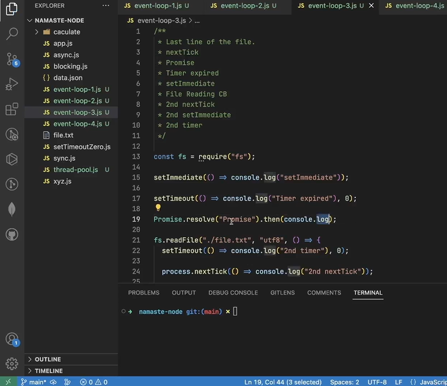

**Output:**

```text
Last line of the file.
nextTick
Promise
Timer expired
setImmediate
File Reading CB
2nd nextTick
2nd setImmediate
2nd Timer
```

---

## Example 4 — Nested `nextTick`

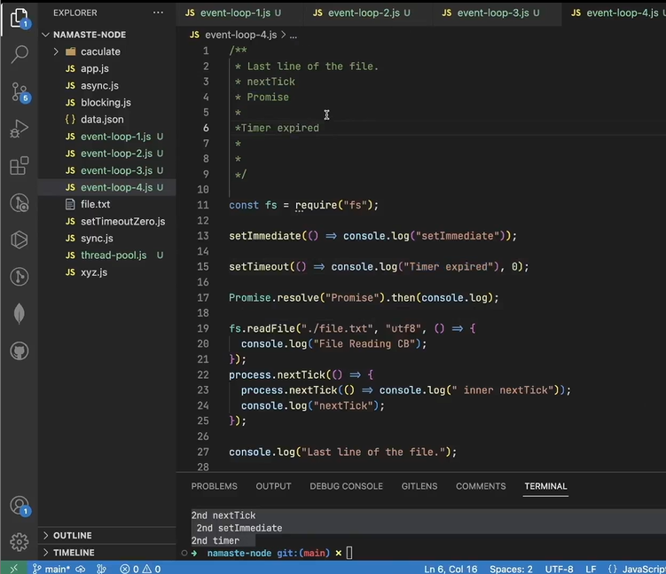

- Here we have a **nested `nextTick`**. The inner `nextTick` callback will be executed before moving to any other phase. This is because the `nextTick` callback queue has the **highest priority** — the event loop will not move to the next phase until the `nextTick` queue is completely empty.

**Output:**

```text
Last line of the file.
nextTick
inner nextTick
Promise
Timer expired
setImmediate
File Reading CB
```
